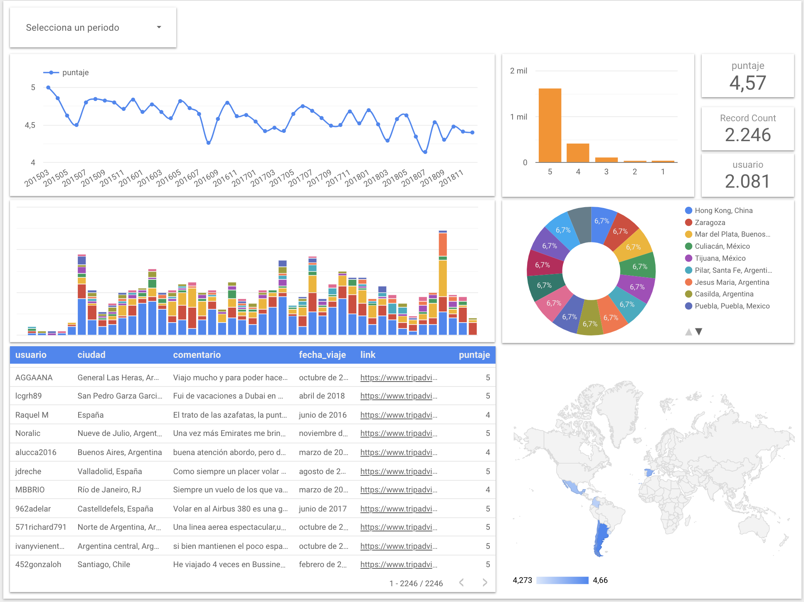

# scraping trip advisor

this is a script to scrape reviews of trip adviser and then present in a dashboar in data studio

estructure:

1-code: the code is presented in python, selenium was used but we can automate without using UI since we do not need user control (the chromedriver in the folder works only for mac!)

2-source: the scrap result is saved in a txt and then imported into a spreadshet of google to connect to a bigquery table.

3-bigquery: here we have the script to create a view in which some logics are presented as date and field country creation, which arises from applying logic in the excel to determine which country corresponds to each city.

4-dashboard: images of the final dashboard.

